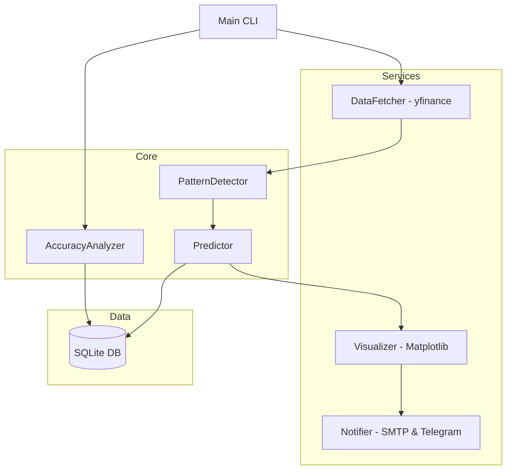

# FormoCast: Mimari Tasarım Dokümanı

## 1. Tasarım Felsefesi
FormoCast, **"Kasıtlı Minimalizm"** ilkesi üzerine inşa edilmiştir. Her mimari seçim, kod yüzey alanını minimize ederken güvenilirliği maksimize edecek şekilde hesaplanmıştır. Geometrik mantığın daha net yorumlanabilirlik sunduğu durumlarda karmaşık ML modellerini reddediyoruz.

## 2. Sistem Mimarisi (Üst Düzey)



### 2.1 Ayrıştırılmış Servis Katmanları
Ölçeklenebilirliği sağlamak için sistem dört farklı katmana ayrılmıştır:

1.  **Veri Katmanı:** `services/data_fetcher.py` - yfinance API'sinin karmaşıklıklarını soyutlar. Önbelleğe alma ve hız sınırlama korumalarını uygular.
2.  **Zeka Katmanı:** `core/detector.py` & `core/predictor.py` - Formasyon tanıma için saf Python mantığı. `numpy` ve `scipy` dışında harici bağımlılık barındırmaz.
3.  **Görsel ve İletişim Katmanı:** `services/visualizer.py`, `services/notifier.py` & `services/telegram_notifier.py` - "Premium" kullanıcı deneyiminden sorumludur. Grafik oluşturma, SMTP ve Telegram gönderimini yönetir.
4.  **Kalıcılık Katmanı:** `db/models.py` - Bir "Tahmin"in yaşam döngüsünü izleyen yönetilen SQLite örneği.

## 3. Derinlemesine İnceleme: Formasyon Tespit Algoritması
"Kara kutu" tespitinden kaçınıyoruz. Algoritmamız deterministik bir geometrik yaklaşım izler:

### 3.1 Pik/Dip Senkronizasyonu
`argrelextrema` kullanarak, fiyat serisinin seyrek bir temsilini oluşturuyoruz.
- **Değişken Pencereleme:** `window` parametresi, gürültü tabanlı tespitleri önlemek için varlığın oynaklığına (volatility) göre dinamik olarak ayarlanabilir.

### 3.2 Formasyon Mantığı: İkili Tepe Örneği
```python
# Sözde Mantık (Pseudo-logic)
def detect_double_top():
    1. Son iki tepe noktasını belirle (P1, P2).
    2. abs(P1.fiyat - P2.fiyat) / P1.fiyat < 0.02 olduğunu doğrula.
    3. Mevcut fiyatın "Boyun Çizgisi"nin (P1 ve P2 arasındaki dip) altında olduğunu kontrol et.
    4. Tahmini onayla: "Aşağı".
```

## 4. Görsel Kimlik (Ultrathink Protokolü)
- **Palet:** 
    - Arka Plan: `#1a1a1a` (Derin Uzay Grisi)
    - Birincil Eylem: `#00d1b2` (Elektrik Turkuazı)
    - Uyarı/Tehlike: `#ff3860` (Canlı Kırmızı)
- **Tipografi:** Raporlar, e-posta istemcilerinde maksimum okunabilirlik için sans-serif yazı tiplerini (Inter/Roboto) kullanır.

## 5. Güvenlik ve Kalıcılık Stratejisi
- **Docker İzolasyonu:** Uygulama rootless bir konteyner içinde çalışır.
- **Volume Stratejisi:** SQLite veritabanı, konteyner yeniden oluşturulduğunda veri kaybını önlemek için kalıcı bir host volume'una bağlanır.
- **Ortam Yönetimi:** Hassas anahtarlar `python-dotenv` aracılığıyla yönetilir, asla Git'e commit edilmez.

## 6. Uç Durum Analizi (Edge Case Analysis)
| Uç Durum | Önleme Stratejisi |
| :--- | :--- |
| **Piyasa Boşlukları (Gaps)** | Bölünmeler ve temettüler için `yfinance` otomatik düzeltmesini kullanma. |
| **E-posta Engelleme** | SMTP gönderiminde üstel geri çekilme (exponential backoff) uygulama. |
| **Formasyon Bulunamaması** | Servisin hala hayatta olduğunu doğrulamak için "Sessiz Taramaları" kaydetme. |
| **Mükerrer Uyarılar** | DB kontrolü, aynı formasyon/ticker çifti için 24 saat içinde tekrar uyarı gönderilmesini engeller. |
