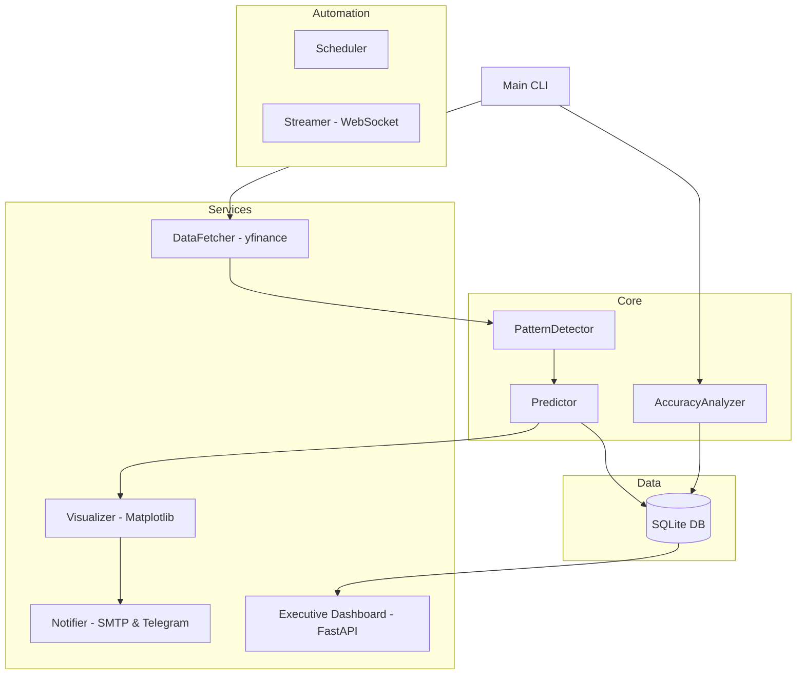

# FormoCast: Mimari Tasarım Dokümanı

## 1. Tasarım Felsefesi
FormoCast, **"Kasıtlı Minimalizm"** ilkesi üzerine inşa edilmiştir. Her mimari seçim, kod yüzey alanını minimize ederken güvenilirliği maksimize edecek şekilde hesaplanmıştır. Geometrik mantığın daha net yorumlanabilirlik sunduğu durumlarda karmaşık ML modellerini reddediyoruz.

## 2. Sistem Mimarisi (Üst Düzey)

### 2.1 Ayrıştırılmış Servis Katmanları (Multi-Service Docker)
Sistem artık Docker Compose üzerinden yönetilen bağımsız mikro-servislere ayrılmıştır:

1.  **FormoCast-Scheduler:** 7/24 otonom çalışan tarama ve raporlama motoru.
2.  **FormoCast-Dashboard:** FastAPI tabanlı, görsel istatistikler sunan web arayüzü.
3.  **FormoCast-Streamer:** WebSocket üzerinden canlı veri akışını yöneten servis.

## 3. Güvenlik ve Docker Optimizasyonu
- **Non-Root User:** Tüm servisler `appuser` adlı düşük yetkili bir kullanıcı ile çalıştırılarak güvenlik arttırılmıştır.
- **Healthchecks:** Docker, servislerin sağlık durumunu `/health` endpoint'i üzerinden periyodik olarak kontrol eder.
- **Persistent Storage:** Veritabanı ve grafikler için ayrılmış Docker Volume'ları kullanılır.

## 4. Yönetici Dashboard'u
FastAPI tabanlı dashboard (`dashboard.py`), kullanıcının projenin performansını bir bakışta görmesini sağlar:
- **Metrikler:** Toplam tespit sayısı, başarı/başarısızlık oranı.
- **Trendler:** En sık görülen formasyonların listesi.
- **Görünüm:** Kasıtlı minimalizm ilkelerine uygun, yüksek kontrastlı Dark-Mode tasarımı.

## 5. Test Stratejisi
Her yeni özellik, `tests/` dizini altındaki birim testleri (unit tests) ile doğrulanmalıdır.
- **Birim Testleri:** `docker-compose run test` komutuyla tüm mantık katmanları izole bir şekilde test edilir.
